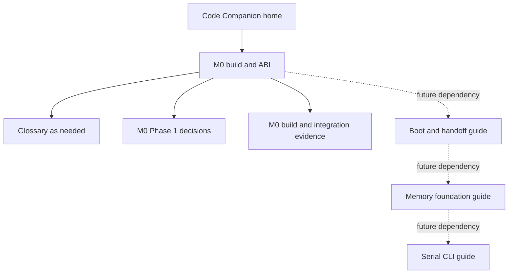

# Code Companion overview

The Code Companion is the human reading path through Kay OS. It supplements
source code and executable tests; it does not replace either one.

## Reading layers

Each module guide supports four depths of reading:

1. **Outcome:** what problem the module solves and why it exists.
2. **System model:** how control, data, ownership, and failures move through it.
3. **Implementation tour:** which files and declarations implement the model.
4. **Evidence:** what was compiled, inspected, executed, or deliberately left
   unproven.

You can stop after any layer and return later without losing the overall map.

## Current reading path

Only the solid-path M0 build/ABI guide exists today. Dotted nodes indicate
future reading paths, not implemented components.

## Required module-guide contract

Every module guide begins from
[the module-guide template](module-guide-template.md) and retains these
second-level sections:

- Problem
- Mental model
- Important files
- Execution flow
- Data structures
- Ownership and lifetime
- Privilege and trust boundaries
- Failure behavior
- Tests and evidence
- What this does not demonstrate
- Language and OS concepts
- Revision and maintenance

The number and names of lower-level sections follow the real module. Guides
may add material, but they must not hide limitations or omit a required
boundary merely to appear simpler.

## Source coverage

[`coverage.tsv`](coverage.tsv) maps implementation source files to the guide
that explains them. The documentation verifier fails when a file under `src/`
is missing from the manifest, when a mapped path does not exist, or when its
guide does not name that path.

Build, linker, configuration, test, and verification files that materially
define a module are also mapped. The manifest proves discoverability, not that
an explanation is correct; review remains responsible for semantic accuracy.

## Documentation workflow

1. Start a new guide from the template or update the existing owning guide.
2. Update the source-coverage manifest.
3. Define new terminology in the [glossary](glossary.md).
4. Fill in the pull request's reader guide.
5. Run `scripts/docs/verify-code-guide.sh`.
6. Review the generated HTML site, code blocks, Mermaid diagrams, navigation,
   mobile width, light mode, and dark mode.

Generated HTML is disposable. Markdown, configuration, coverage, CSS, and the
verification scripts are the reviewed sources of truth.
