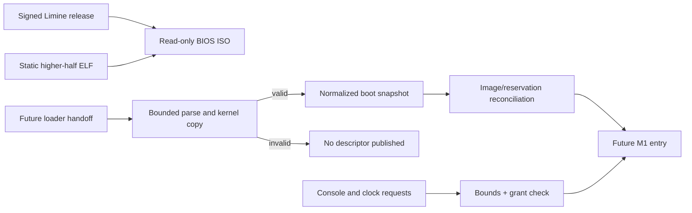

# M0 boot and interface contracts

This guide explains the executable contracts that sit between the proven M0
toolchain and the future booting kernel. They define what Kay OS is willing to
accept before M1 starts relying on firmware, loader, image, console, or clock
state.

!!! important "Current status"

    The pure contract tests, compiled-policy reconciliation, shared-contract
    ELF audit, signed Limine input, and deterministic ISO checks passed on the
    clean Section 2.1 commit `f85571e`. Independent follow-up review found no
    remaining implementation blocker. The user/project owner accepted the
    Phase 2 handoff on 2026-09-19. Guest execution remains outside this phase's
    claim.

## Problem

A loader can provide useful machine state, but its pointers and counts are not
automatically safe kernel objects. Likewise, an ELF file being parseable does
not mean its ranges, entry, permissions, and reservations are mutually
consistent. Console and time calls also become accidental authority channels if
their sizes, errors, and grants are implicit.

Phase 2 turns those assumptions into bounded data and executable rejection
cases before the guest kernel enforces them.

## Mental model



Validation is transactional: the boot parser returns a fixed-size normalized
snapshot only after all records pass, and image admission returns a
`ValidatedImage` only after every boot-map, range, permission, entry, and
overlap check passes.

## Important files

Read these files in order:

| Order | File | Responsibility |
| ---: | --- | --- |
| 1 | `config/m0/phase-02-contracts.json` | Machine-readable accepted decisions, bounds, and owners. |
| 2 | `src/m0/contracts.zig` | Allocation-free boot, image, authority, and time validators plus unit fixtures. |
| 3 | `src/m0/limine.zig` | Exact request markers and selected Limine base revision embedded in the kernel. |
| 4 | `src/m0/kernel.zig` | Minimal higher-half root that exposes the selected revision and terminal panic. |
| 5 | `src/m0/image_audit.zig` | Parses the emitted ELF and submits its real load segments to the shared contract. |
| 6 | `src/m0/policy_dump.zig` | Exports the compiled Zig operation and result-code tables for structural comparison. |
| 7 | `config/m0/phase-02-cases.json` | Stable positive/negative case IDs, runner ownership, and deadlines. |
| 8 | `scripts/m0/check-phase-02-policy.py` | Structurally reconciles JSON, emitted Zig policy, linker, shell bounds, and exact case results. |
| 9 | `linker/x86_64-m0-higher-half.ld` | Static virtual/physical layout, Limine tags, stack size, and segment permissions. |
| 10 | `build.zig` | Adds the constrained `kay-m0-kernel` artifact without replacing the Phase 1 fixture. |
| 11 | `config/m0/limine.conf` | Read-only ISO boot entry. |
| 12 | `config/m0/limine-release-signing-key.asc` | Pinned public key used only after its fingerprint is checked. |
| 13 | `scripts/m0/verify-limine-release.sh` | Verifies archive/signature hashes, fingerprint, detached signature, and members. |
| 14 | `scripts/m0/build-boot-image.sh` | Builds the kernel and deterministic read-only BIOS ISO. |
| 15 | `scripts/m0/verify-phase-02-contracts.sh` | Runs tests, two clean builds, shared-contract ELF audit, and evidence capture. |
| 16 | `scripts/m0/verify-phase-02.sh` | Authenticates inputs, requires the exact manifest result set, records tool identities, and regresses Phase 1. |
| 17 | `docs/m0/phase-02-decisions.md` | Human decision record and evidence boundary. |

## Execution flow

### Boot snapshot validation

`validateBootSnapshot` first checks the fixed header, declared byte count,
record count, and unsupported flags. It then uses checked arithmetic while
walking sorted memory extents. Zero lengths, unknown kinds, overlap, overflow,
and a map with no usable memory fail before a fixed-size `BootSnapshot` is
returned. That snapshot retains every normalized extent; image admission must
prove the complete kernel span lies inside its kernel reservation.

### Image validation

`validateImage` admits at most eight page-aligned higher-half segments. Each
segment must be readable, file bytes may not exceed memory bytes, and writable
code is forbidden. Physical ranges must fit the 64 MiB fixture and may not
escape the normalized kernel reservation. Virtual, physical, and non-empty
file ranges may not overlap. The entry must fall inside an executable segment,
and success returns the only publishable validated descriptor.

### Interface validation

`authorize` uses a table for all four operations. Every row fixes caller,
endpoint, required grant, payer, enforcing owner, response schema, and maximum
transfer. A console transfer is 1–256 bytes. Clock reads return one `u64`;
waits use an absolute monotonic-nanosecond deadline. Rejections use stable
numeric result codes. `millisecondsToNanoseconds` fails on overflow rather than
wrapping.

### Static-image build

`zig build boot-kernel` emits a static `ET_EXEC` with two page-aligned load
segments: read/execute text and read/write Limine request data plus zero-fill.
The first virtual address is `0xffffffff80000000`; its physical load address is
`0x00200000`.

## Data structures

The boot wire header is 24 bytes, followed by at most 32 records of 24 bytes.
The complete snapshot is capped at 4096 bytes.

| Header field | Width | Meaning |
| --- | ---: | --- |
| magic | 4 | Little-endian `KYB0` identity. |
| version/header size | 2 + 2 | Exact schema compatibility. |
| total size | 4 | Must equal the supplied slice length. |
| record count/flags | 2 + 2 | Bounded count; flags are currently zero. |
| kernel physical base | 8 | Cross-check input for later image reconciliation. |

An `ImageSegment` keeps virtual address, physical address, file offset, file and
memory sizes, alignment, and read/write/execute bits together. An
`AuthorityRequest` keeps caller, endpoint, operation, grant set, request and
response sizes, current time, and deadline together. `OperationContract`
supplies payer, enforcing owner, response shape, and bounds; `ResultCode` fixes
the wire-stable outcome encoding.

## Ownership and lifetime

Raw handoff bytes are borrowed only for the duration of validation. The future
kernel must copy accepted values into kernel-owned storage; pointers into loader
memory do not survive normalization. Image segment and reservation slices are
read-only loans during validation. Console data crosses by copy, never by an
unbounded shared pointer. The host owns generated build and evidence directories.

## Privilege and trust boundaries

The host, selected firmware, verified loader release, and kernel are trusted in
this M0 model. Their outputs are still checked where the format permits.
Future user domains are untrusted. A CLI endpoint grant authorizes only one
bounded operation class; it does not authorize physical memory or unrelated
kernel services. The selected interrupt-gate design is not implemented here.

## Failure behavior

Every malformed contract returns a specific error and publishes no summary.
Arithmetic overflow, unsupported values, conflicting ranges, missing grants,
and deadline errors are ordinary rejection paths. A future unrecoverable guest
fault emits one bounded emergency serial record and then halts stably. Host
scripts use finite deadlines and nonzero exits; missing tools remain failures.

## Tests and evidence

Run:

```console
scripts/m0/verify-phase-02-contracts.sh /absolute/empty/evidence-directory
```

The contract driver runs 19 Zig tests, including 17 stable manifest cases and
two invariant checks. It performs two
clean higher-half builds in different directories, compares the bytes, and
audits ELF type, entry, virtual/physical mapping, permissions, dynamic metadata,
relocations, zero-fill, Limine tags, and stack shape. The emitted segments then
pass through `validateImage` with the normalized boot snapshot. It records
hashes, dirty state, and the evidence boundary.

Verify the selected loader independently:

```console
scripts/m0/verify-limine-release.sh ARCHIVE SIGNATURE \
  config/m0/limine-release-signing-key.asc /absolute/empty/output
```

The boot-image builder additionally requires `xorriso`. Its output is not a
passing guest boot test merely because an ISO file exists.

Run the complete Phase 2 integration gate with the exact release inputs:

```console
XORRISO=/path/to/xorriso scripts/m0/verify-phase-02.sh \
  /absolute/empty/evidence-directory \
  /path/to/limine-binary-12.9.0.tar.xz \
  /path/to/limine-binary-12.9.0.tar.xz.sig
```

It repeats the signed-input and ISO builds, checks the negative supply/tool
paths, requires the exact 24-case manifest/result set with no duplicates,
records every tool binary identity, and reruns the complete Phase 1 driver.

## What this does not demonstrate

- No CPU has executed the higher-half entry.
- The Limine discovery/base-revision tags are embedded, but no Limine response
  has yet been parsed in the guest.
- No ring-3 interrupt, TSS stack switch, or `iretq` has run.
- No serial console or clock device is implemented.
- No QEMU boot or physical T7500 behavior is established.
- The abstract `KYB0` snapshot is Kay's normalized schema, not Limine's native
  in-memory request/response ABI.

## Language and OS concepts

Checked arithmetic returns an error on overflow instead of allowing address
ranges to wrap. A packed flag structure gives three permission bits an explicit
representation. A slice is a pointer plus length; its bounds do not establish
ownership, which is why accepted loader values must be copied. ELF program
headers describe ranges the loader maps; linker sections are a build-time view
and are not the admission contract. See the [glossary](glossary.md) for
capabilities, higher-half kernels, monotonic clocks, and transactional
validation.

## Revision and maintenance

This guide describes the independently reviewed Phase 2 contract implementation
tested at commit `f85571e2f2bb036c258fd596552731422cb41b38` on 2026-09-18.
The retained execution record distinguishes that tested implementation from
its later documentation commit. Reopen it
when the Limine release/protocol, wire schema, image subset, bounds, ABI,
interrupt mechanism, grants, clock units, fault action, linker layout, or
verification cases change.
