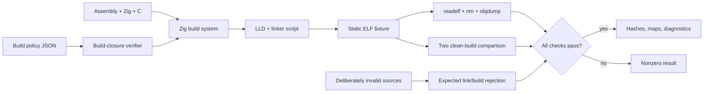
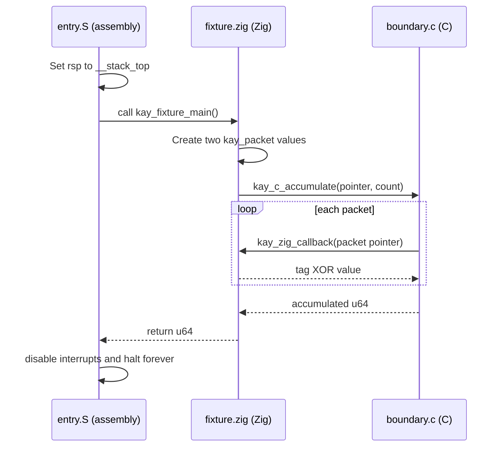

# M0 build and ABI

This guide explains the first native Kay OS artifact: a small freestanding ELF
that combines assembly, Zig, and C. Its job is to qualify the compiler, linker,
binary layout, and a narrow cross-language calling convention before boot code
or kernel interfaces depend on them.

!!! important "Current status"

    The fixture compiles, links reproducibly, and passes structural audits. It
    has **not** been loaded or executed as an operating system image. Runtime
    steps below describe the control flow encoded in the binary, not an
    observed boot.

## Problem

Kernel development cannot safely begin from the assumption that a normal
application toolchain will behave like a freestanding kernel toolchain. A
compiler may silently expect a C library, compiler runtime helper, stack
protector, unwinder, floating-point state, dynamic loader, or host system call.
Different languages may also disagree about structure layout or calling rules.

M0 Phase 1 therefore asks a smaller, testable question:

> Can the pinned Zig 0.16.0 LLVM/LLD toolchain produce a static Intel x86-64
> ELF in which assembly calls Zig, Zig calls C, and C calls Zig back—without
> hidden host or runtime dependencies?

The answer is yes for the deliberately narrow signatures and processor-state
profile described here. That result qualifies a development boundary; it does
not define the future boot, syscall, or user/kernel ABI.

## Mental model

There are two related flows to understand.

### Build and audit flow



The normal sources must build and audit cleanly. The negative fixtures must
fail for the expected reason. Either an unexpected normal failure or an
unexpected negative success fails the gate.

### Encoded call flow



This round trip deliberately crosses each initial language boundary. The
returned number is currently ignored; the fixture proves linking, layout, and
call construction rather than useful kernel behavior.

## Important files

Read the implementation in this order:

| Order | File | Language / format | Responsibility |
| ---: | --- | --- | --- |
| 1 | `config/m0/build-closure.json` | JSON | Declares the accepted target, toolchain, ABI, negative cases, and reproducibility policy. |
| 2 | `src/m0/abi.h` | C header | Defines the shared packet layout and functions visible across C and Zig. |
| 3 | `src/m0/fixture.zig` | Zig | Rechecks layout, provides Zig exports, creates packets, and calls C. |
| 4 | `src/m0/boundary.c` | C | Iterates over packets and calls the Zig callback. |
| 5 | `src/m0/entry.S` | x86-64 assembly | Defines `_start`, installs the fixture stack, calls Zig, and halts. |
| 6 | `linker/x86_64-m0.ld` | LLD linker script | Places the ELF at `0x200000` and defines sections and stack symbols. |
| 7 | `build.zig` | Zig build description | Fixes the freestanding target and compilation/link flags. |
| 8 | `scripts/m0/build-fixture.sh` | Bash | Builds and captures ELF, symbol, layout, disassembly, and hash artifacts. |
| 9 | `scripts/m0/verify-build-closure.sh` | Bash | Builds twice, compares outputs, audits the ELF, and runs negative cases. |
| 10 | `tests/m0/negative/undefined-helper.c` | C | Forces an unavailable compiler helper to prove it is rejected. |
| 11 | `tests/m0/negative/host-syscall.c` | C | Attempts a host-style `write` call to prove host imports are rejected. |

Phase 2 extends `build.zig` with a separate `kay-m0-kernel` target. It preserves
these Phase 1 fixtures and their linker script; the new higher-half layout is
explained in the [boot and interface contract guide](m0-boot-and-interface-contracts.md).

The older engineering record `docs/m0/build-closure.md` states the formal
qualification result. This guide supplies the learning-oriented path through
the same implementation.

## Execution flow

### 1. The policy declares what is allowed

`config/m0/build-closure.json` names the artifact a
`non-bootable-freestanding-qualification-elf`. It fixes:

- `x86_64-freestanding-none` and the Nehalem CPU model;
- Zig 0.16.0 with LLVM and LLD;
- a static `ET_EXEC` ELF at address `0x200000`;
- no libc, compiler runtime, PIC, PIE, red zone, allocation, or FP/SIMD;
- a 16 KiB qualification stack;
- assembly→Zig, Zig→C, and C→Zig calls; and
- the required negative and reproducibility cases.

This JSON is a policy record, not executable configuration by itself. The
scripts must independently enforce its important claims.

### 2. The build selects a freestanding machine

`build.zig` resolves an explicit target instead of inheriting the development
computer's CPU:

```zig title="build.zig — selected target" linenums="3"
const target = b.resolveTargetQuery(.{
    .cpu_arch = .x86_64,
    .os_tag = .freestanding,
    .abi = .none,
    .cpu_model = .{ .explicit = &std.Target.x86.cpu.nehalem },
});
```

`freestanding` tells Zig that no host operating system contract is available.
The explicit Nehalem model prevents the build from accidentally emitting
instructions merely because the developer's current CPU supports them.

The module then disables facilities whose ownership has not been established:

```zig title="build.zig — constrained module options" linenums="19"
.link_libc = false,
.single_threaded = true,
.unwind_tables = .none,
.stack_protector = false,
.stack_check = false,
.sanitize_c = .off,
.pic = false,
.red_zone = false,
.error_tracing = false,
```

These settings are not general recommendations for a mature kernel. They are
the smallest accepted profile for this qualification fixture. Later phases
must add facilities only after assigning their state, failure, and runtime
responsibilities.

The C compiler receives matching restrictions, including `-ffreestanding`,
`-fno-builtin`, `-mno-red-zone`, `-mno-sse`, and `-msoft-float`. Warnings are
errors. Zig uses LLVM for code generation and LLD for linking.

### 3. C and Zig agree on one structure

The complete shared declaration is embedded directly from `src/m0/abi.h`:

```c title="src/m0/abi.h" linenums="1"
--8<-- "src/m0/abi.h"
```

The four C `_Static_assert` expressions stop compilation if size, alignment,
or offsets drift. They establish this layout:

| Byte range | Field | Type | Meaning in this fixture |
| ---: | --- | --- | --- |
| 0–7 | `tag` | `uint64_t` | First input to the callback's XOR operation. |
| 8–15 | `value` | `uint64_t` | Second input to the callback's XOR operation. |

The header also declares one function implemented by Zig and one implemented
by C. A declaration tells the compiler how a call must look; the linker later
connects that declaration to a symbol with the same name.

### 4. Zig checks the translated C view

The complete Zig side is embedded from `src/m0/fixture.zig`:

```zig title="src/m0/fixture.zig" linenums="1"
--8<-- "src/m0/fixture.zig"
```

`@cImport` translates the C declarations into Zig-visible declarations.
The `comptime` block repeats the size, alignment, and offset checks from Zig's
view. If either compiler sees a different layout, the build fails before
linking.

`export fn kay_zig_callback(... ) callconv(.c)` does two important things:

1. `export` creates a linker-visible symbol with the declared name.
2. `callconv(.c)` makes the function follow the target's C calling convention.

`kay_fixture_main` creates two packets on its stack and lends an immutable
pointer plus a count to C:

```zig title="src/m0/fixture.zig — packet construction" linenums="23"
export fn kay_fixture_main() callconv(.c) u64 {
    const packets = [_]abi.struct_kay_packet{
        .{ .tag = 0x4b4159, .value = 1 },
        .{ .tag = 0x4d30, .value = 2 },
    };
    return abi.kay_c_accumulate(&packets, packets.len);
}
```

### 5. C calls Zig back

The complete C implementation is embedded from `src/m0/boundary.c`:

```c title="src/m0/boundary.c" linenums="1"
--8<-- "src/m0/boundary.c"
```

For each element, C calculates its address and calls the Zig callback. The
callback returns `tag XOR value`; C adds those results using unsigned 64-bit
arithmetic.

If the encoded flow were executed with these packets, it would calculate:

```text
(0x4b4159 XOR 1) + (0x4d30 XOR 2)
= 0x4b4158 + 0x4d32
= 0x4b8e8a
```

The value demonstrates argument and result flow, but `_start` does not inspect
it yet.

### 6. Assembly supplies the synthetic entry

The complete entry is embedded from `src/m0/entry.S`:

```asm title="src/m0/entry.S" linenums="1"
--8<-- "src/m0/entry.S"
```

The linker will resolve `__stack_top` and `kay_fixture_main`. `_start` loads the
stack pointer, clears the frame pointer, calls Zig, then enters a loop that
disables maskable interrupts and halts the CPU.

`cli` and `hlt` are privileged operations in the intended environment. Their
presence in a linked binary does not prove the CPU ever executed them or that
the required privilege and processor mode were established.

### 7. The linker gives symbols addresses

`linker/x86_64-m0.ld` begins the synthetic image at 2 MiB. It keeps the entry
section first, aligns major sections to 4 KiB, and reserves 16 KiB inside
`.bss` for the fixture stack.

```text title="linker/x86_64-m0.ld — conceptual layout"
0x200000  __image_start, .text, _start
          .rodata
          .data
          .bss, __bss_start
          __stack_bottom
          16 KiB reserved stack
          __stack_top, __bss_end
          __image_end
```

The `.bss` section is marked `NOLOAD`: its zero bytes are not stored in the
file. A real loader will eventually need to reserve and initialize this memory.
No such loader is qualified here.

### 8. The scripts build, inspect, and try to break the contract

`scripts/m0/build-fixture.sh` builds both a stripped acceptance ELF and an
unstripped audit ELF. It captures hashes, symbols, ELF headers, program
headers, and disassembly using standard binary-inspection tools.

`scripts/m0/verify-build-closure.sh` copies the repository into two different
absolute directories with independent Zig caches. It requires:

- byte-identical stripped acceptance ELFs;
- identical symbol and ELF maps;
- ELF64, static `ET_EXEC`, x86-64, and entry address `0x200000`;
- no dynamic interpreter or dynamic section;
- no undefined symbol in the audit ELF;
- every required cross-language and stack symbol;
- no observed x87, MMX, XMM, YMM, or ZMM use; and
- explicit rejection of all three negative cases.

The unstripped audit ELFs may differ only because DWARF debug information
records each absolute source path. The directly generated stripped artifact is
the reproducibility target.

## Data structures

### `kay_packet`

`kay_packet` is the only shared record. It is exactly 16 bytes and aligned to
eight bytes. Both fields are fixed-width integers, so their widths agree. The
fixture does not define a serialized byte order because the record is passed
in native memory within one x86-64 image.

### Pointer plus count

`kay_c_accumulate` receives:

- a pointer to the first packet; and
- a `size_t` count telling C how many contiguous packets exist.

This is a common C interface shape, but it is not self-validating. The pointer
does not carry the buffer's length, allocation identity, lifetime, address
space, or authority. In this controlled fixture, Zig constructs a matching
array and count. A future untrusted interface must validate those properties
before using a pointer this way.

### Linker-defined stack

The linker reserves 16 KiB and publishes bottom/top symbols. The stack grows
toward lower addresses on x86-64, so entry initializes `%rsp` to the top. There
is no guard page, overflow detection, per-thread ownership, or reclamation in
this fixture.

## Ownership and lifetime

The ownership chain is intentionally simple:

1. `kay_fixture_main` owns the two-element `packets` array on its stack.
2. Zig lends C an immutable pointer for the duration of
   `kay_c_accumulate`.
3. C lends the callback an immutable pointer to one array element during each
   callback.
4. Neither C nor the callback stores the pointer or transfers ownership.
5. The array remains alive until `kay_c_accumulate` returns to Zig.

No heap or allocator exists. No function frees memory. The panic and assembly
halt paths never return, so they deliberately terminate the fixture's useful
control flow rather than clean up resources.

The compiler can check types and some mutation restrictions; it cannot derive
the complete cross-language lifetime contract from the C pointer alone. The
guide and tests therefore make that contract explicit.

## Privilege and trust boundaries

### Trusted development inputs

This qualification trusts the pinned Zig/LLVM/LLD toolchain, the host shell
and binary-inspection utilities, the repository sources, and the verifier. The
two clean paths test reproducibility but are still created on one host.

### No demonstrated guest boundary

The ELF has no demonstrated firmware loader, boot protocol, page tables,
descriptor tables, exception handlers, interrupt setup, or transition between
kernel and user privilege. It should not be described as a running kernel.

### No untrusted caller

All pointers and counts originate inside the fixture. `kay_c_accumulate` does
not reject a null pointer, an excessive count, misalignment, address overflow,
or an unmapped range. That is acceptable only because this is a controlled ABI
probe rather than an exposed kernel operation.

### Host behavior is not guest behavior

The host builds and inspects the binary. A successful host command does not
prove that SeaBIOS, QEMU, or the physical T7500 can load it. The physical
machine is entirely outside this guide's evidence.

## Failure behavior

Failures occur at three different stages.

### Compile-time layout failure

C `_Static_assert` and Zig `comptime` checks stop compilation if packet size,
alignment, or offsets disagree. This prevents a silently corrupted call.

### Link-time dependency failure

`tests/m0/negative/undefined-helper.c` performs 128-bit division while
compiler-rt is disabled. The link must reject the missing `__udivti3` helper.

`tests/m0/negative/host-syscall.c` declares `write`, as a hosted program might.
With no libc or host syscall veneer, the link must reject the undefined
`write` symbol.

These tests show that dependencies are not silently supplied. They do not show
that every possible C or Zig expression is dependency-free.

### Build-policy failure

The verifier attempts `-Dcpu=haswell`. Since `build.zig` exposes no such option,
the build must reject it rather than silently changing the accepted CPU.

### Encoded terminal failure

Zig's panic implementation calls `kay_panic`, which loops over `cli; hlt`.
The assembly entry uses the same terminal behavior after main returns. There is
no message, reset, recovery, or watchdog inside the fixture. These paths are
only compiled and inspected in Phase 1, not executed.

## Tests and evidence

The primary command is:

```sh
ZIG=/absolute/path/to/zig \
  scripts/m0/verify-build-closure.sh \
  /absolute/empty/evidence-directory
```

The 2026-09-17 clean qualification passed with Zig 0.16.0. The stripped ELF
from both clean builds had SHA-256:

```text
e94b127fcc4388e73b4620a8b0908dcdeed0c3a08fbf0052d92cce58a3baf31a
```

The verifier observed the required symbols `_start`, `kay_fixture_main`,
`kay_c_accumulate`, `kay_zig_callback`, `kay_panic`, `__stack_bottom`, and
`__stack_top`. It observed no forbidden FP/SIMD register use. The three
negative diagnostics matched `__udivti3`, `write`, and invalid `-Dcpu`.

`scripts/m0/verify-phase-01.sh` later reran this build gate inside the wider
Phase 1 virtual-input suite. That suite passed again on merged `main` revision
`bc4c9984d776d75f23cb85193c9e3e3ff3270d61` with a clean tree.

The code-guide verifier is separate:

```sh
KAY_MKDOCS=.venv-docs/bin/mkdocs scripts/docs/verify-code-guide.sh
```

It checks that implementation files remain discoverable from guides, required
explanation sections remain present, navigation includes this guide, and the
HTML site builds without MkDocs warnings.

## What this does not demonstrate

This fixture does **not** demonstrate:

- CPU reset, firmware, boot-media, or bootloader behavior;
- entry into x86-64 long mode;
- loading ELF segments or zeroing `.bss`;
- stack mapping, guard pages, or overflow containment;
- execution in QEMU or on the Dell Precision T7500;
- interrupt, exception, timer, or context-switch correctness;
- page tables or memory protection;
- user mode, system calls, safe copying, or privilege transitions;
- validation of pointers supplied by an untrusted address space;
- a stable public kernel, module, user, or BEAM ABI;
- general Zig/C interoperability beyond the tested fixed signatures;
- floating-point or SIMD state ownership;
- allocation, concurrency, unwinding, or recovery; or
- an observable use of the callback's computed result.

These are later contracts and tests. Keeping them outside the Phase 1 claim is
what makes the current result precise and useful.

## Language and OS concepts

The [project glossary](glossary.md) defines the main terms used here. The most
important concepts for this guide are:

| Concept | Why it matters here |
| --- | --- |
| ABI | Lets separately compiled assembly, Zig, and C agree at the binary level. |
| Calling convention | Determines how calls, arguments, results, registers, and the stack behave. |
| Structure layout | Ensures both C and Zig find `tag` and `value` at the same addresses. |
| Pointer | Passes the array address but does not prove validity, lifetime, length, or authority. |
| `comptime` / `_Static_assert` | Reject layout disagreement during compilation. |
| Freestanding target | Removes the assumption that a host OS and standard runtime exist. |
| Compiler helper | A function the compiler may introduce for an operation the CPU instruction selection does not supply directly. |
| Linker script | Gives sections and symbols explicit addresses and reserves the synthetic stack. |
| ELF | Carries the linked code, data, entry address, sections, and program headers. |
| Red zone | A user-space stack convention disabled because future interrupts could overwrite it. |
| FP/SIMD state | Processor state forbidden until the kernel explicitly owns its setup and switching. |
| Negative test | Demonstrates that forbidden or unsupported behavior is rejected. |

You do not need to memorize these definitions before continuing. Return to the
glossary as each concept becomes relevant in later guides.

## Revision and maintenance

This guide reviews the implementation merged at
`bc4c9984d776d75f23cb85193c9e3e3ff3270d61`. The Code Companion convention and
HTML presentation were added afterward without changing the fixture's binary
contract.

Update this guide and rerun both documentation and build verification whenever
any of the following changes:

- a file mapped to this guide in `docs/code-guide/coverage.tsv`;
- the Zig version, backend, linker, target, CPU, or compilation flags;
- ABI declarations, calling conventions, exported symbols, or packet layout;
- linker addresses, sections, stack size, or discarded metadata;
- dependency, instruction, negative-case, or reproducibility policy;
- the accepted artifact hash or evidence boundary; or
- the distinction between compiled, emulated, and physical observations.

A later bootable image should receive its own guide rather than silently
expanding this fixture guide into a claim it was not designed to support.
